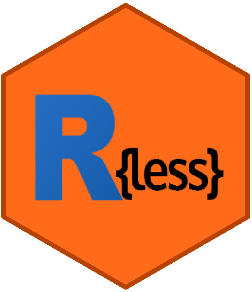

<!-- README.md is generated from README.Rmd. Please edit that file -->

```{r setup, include = FALSE}
knitr::opts_chunk$set(
  collapse = TRUE,
  comment = "#>",
  fig.path = "man/figures/",
  out.width = "100%"
)

library(badger)
```

# rless <a href='https://github.com/ciirc-kso/rless'></a>

[](https://cran.r-project.org/package=rless)[](https://travis-ci.org/ciirc-kso/rless)
`r badge_devel("ciirc-kso/rless", "blue")`
`r badge_cran_download("rless", "grand-total", "blue")`

`rless` is R package providing CSS preprocessor features to R users. 

It uses [LESS][less-link] language, which is an CSS extension giving option to use variables, functions or using operators while creating styles. Visit oficial [LESS][less-link] website for more information about language specifics.

Provided LESS content is converted into CSS using [V8][V8-link] JavaScript engine.

## Installation

You can install the released version of rless from [CRAN](https://CRAN.R-project.org) with:

``` r
install.packages("rless")
```
or install the latest development build from Github:
``` r
# install.packages("devtools")
devtools::install_github("ciirc-kso/rless")
```

## Examples

The simplest way to use `rless` is to call `parse_less` function with less content.

``` {r}
library(rless)

less <- "
@width: 10px;
@height: @width + 10px;

#header {
  width: @width;
  height: @height;
}
"

css <- parse_less(less)
cat(css)

```

``` {r}
less <- "
.bordered {
  border-top: dotted 1px black;
  border-bottom: solid 2px black;
}

#menu a {
  color: #111;
  .bordered();
}

.post a {
  color: red;
  .bordered();
}
"

css <- parse_less(less)
cat(css)

```

We strongly recommend to visit official [guide][less-features] to grasp the full power of the LESS preprocessor tool. 

[less-link]: http://lesscss.org/
[less-features]: http://lesscss.org/features/
[V8-link]: https://github.com/jeroen/V8
